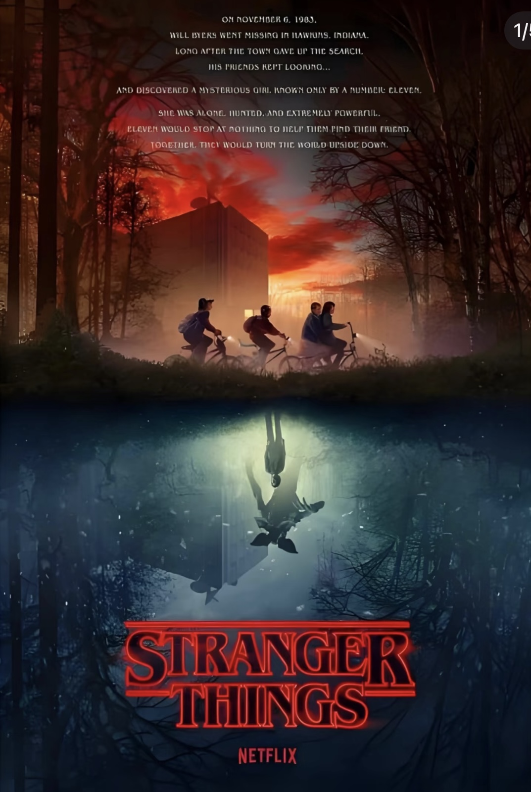

# final-project_dgao0048_9103_tut1

This project is adapted from the collaborative apple-tree base code created by my group, upon which I developed additional **user-input** interactions.

## Interactive Apple Tree — Inspired by *Stranger Things*

This project is an interactive, animated apple-tree environment that transforms between two parallel worlds:  
a bright and lively day/night world, and an unsettling, corrupted “UpsideDown” world inspired by the TV series **Stranger Things** -- "An Otherworldly Abyss Beneath a Normal Town". The drama begins in the peaceful Hawkins town of the 1980s and gradually uncovers the hidden "Upside Down" beneath the town through the adventures of a group of children. 

This strong contrast between "reality and the otherworld" is centered around an "interactive apple tree", creating two completely opposite spaces: the "positive bright world" and the "negative dark world". These two worlds seamlessly switch through the "scene flip" action and share the "apple tree" as a visual anchor to ensure the coherence of the narrative logic.

## How to Interact with the Work

This project contains **two different worlds** that you can switch between.  
Interaction is done through **mouse clicks** and **keyboard input**.

###  Start
When the page loads, the animation begins automatically.  
Use your **mouse** and **keyboard** to interact with the scene.

### Day / Night Toggle (Normal World Only)

- Press **T** to switch between **Day** and **Night**.
- This function is **disabled** in the UpsideDown World.

**Day:** blue sky, green leaves sway, apples fall slowly  
**Night:** dark blue sky, moon appears, leaves grow from small to large, fireflies appear

###  Rain (Rain ☔ Button)

- Click the **Rain ☔** button (top-right) to toggle rain.
- Rain is **only visible in the Normal World**.

**Special behavior:**

- If rain is activated during **daytime**, leaves begin to fall.
- If you enter the **UpsideDown World** afterward:
  - Rain is **not drawn**
  - Leaves **continue falling** (they turn black)

### Leaf Behavior

- **Normal Day:** green leaves gently sway  
- **Normal Night:** leaves slowly grow  
- **Normal Day/Night + Rain:** leaves fall downward  
- **UpsideDown World (entered from Day):** leaves turn **black**, falling continues if triggered  
- **UpsideDown World (entered from Night):** leaves shrink to **0** and disappear  

###  Entering / Exiting the UpsideDown World

- Click the **tree trunk** to flip the world.
- The entire canvas rotates **180°**.

#### Entering the UpsideDown World

- Background becomes **purple** and dynamic  
- Leaves turn **black** or disappear  
- Apples follow a surreal cycle:  
  **rising → floating → returning to branch → repeat**

#### Exiting the UpsideDown World

- Rotation returns to **normal**  
- All apples **reset** to their original positions  
- Day/Night toggle and Rain effects work normally again  

###  Apple Behavior

#### Normal World  
waiting → falling → landing → reset → repeat

#### UpsideDown World  
waiting → rising upward → floating → returning to branch → repeat

## My Individual Approach to Animating the Group Code

 In my version, users can click the tree trunk to flip between the normal world and the UpsideDown world, and can press T in the normal world to switch between day and night, while the animation is driven primarily by interaction (mouse clicks, key presses) and time-based progression (continuous frameCount-driven changes) together with Perlin-like randomness that gives the entire scene a gentle breathing motion, with animatable properties including the swaying of tree branches, the cyclical growth and falling of apples, the glowing apples at night, the drifting golden fireflies, variations in rainfall density, and the corrupted apples and drifting smoke that appear only in the UpsideDown world.
 
Visually influenced by the iconic aesthetic cues of Stranger Things—the purple-black tones of the UpsideDown, the floating particles, and the ominous smoky atmosphere—I implemented a dynamically shifting cool-toned background, floating dark particles, and lightly trembling branches to evoke instability and eerie tension, and technically, using p5.js drawing functions and custom classes such as Segment, Apple, Firefly, RainDrop, and SmokeParticle, I constructed modular behaviors while separating world-space from screen-space coordinates to maintain stable UI scaling, applied translate-rotate easing for natural world-flip transitions, and integrated a scaleFactor resizing system to ensure that the entire scene preserves correct proportions and remains fully responsive across varying browser window sizes.

## Technical Explanation

- The state machine controls the four stages of the apple: waiting → falling → floating → returning → reset;
- Anti-gravity in the upside-down world: this.dropSpeed -= appleGravity; 
- Floating trajectory: this.y += sin(frameCount * 0.05) * 0.5; 
- Smooth transition back to the branch: this.x = lerp(this.x, this.startX, 0.02); 
- Overall world flip: flipAngle = lerp(flipAngle, targetAngle, 0.08); 
- Blackening of leaves in the upside-down world: if (isUpsideDown) fill(0); 
- Dynamic background (time-driven): The RGB values are changed based on sin() / cos() to make the background pulse.

## The main modifications I made to the original group code 

I expanded on the basic code, including: adding a complete "Inverted World" system, adding the Apple's four-stage loop behavior, adding an anti-gravity mechanism, leaves turning black in the alternate world, and adding a dark particle and smoke particle system.

## Tools and technique from outside the course

The implementation of the floating animation effect and the button interaction system was generated with the assistance of ChatGPT, which also helped resolve several technical issues and improve the overall stability of the project, such as preventing the floating logic from affecting the normal world, fixing duplicated leaf rendering, correcting excessive apple acceleration under gravity, and addressing incorrect apple state transitions during world switching.